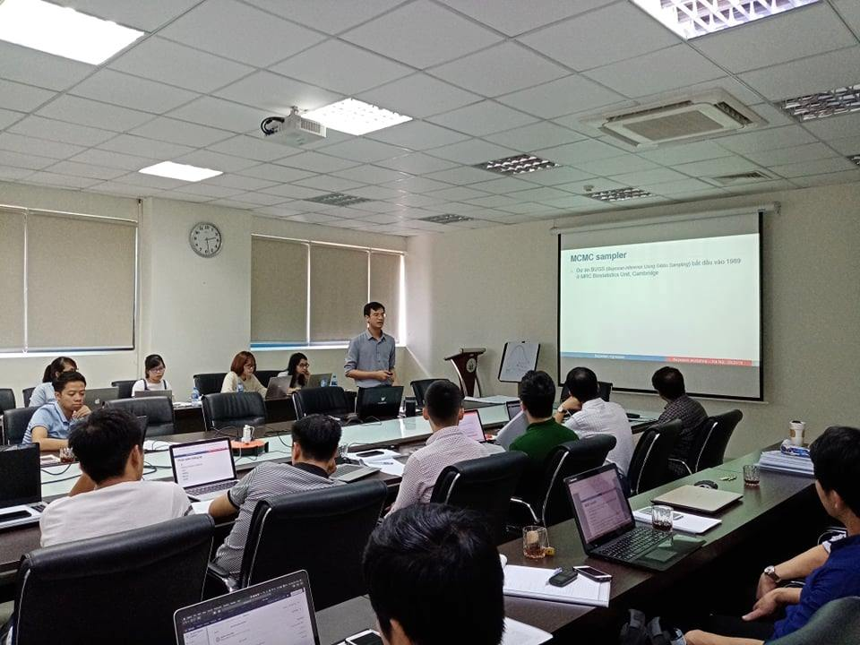
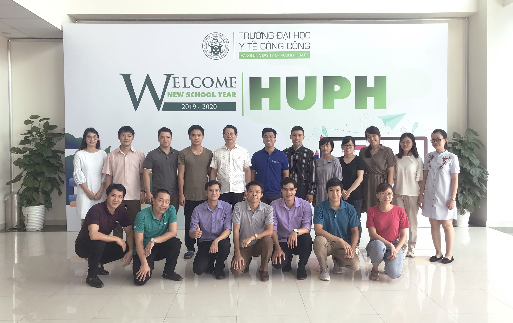
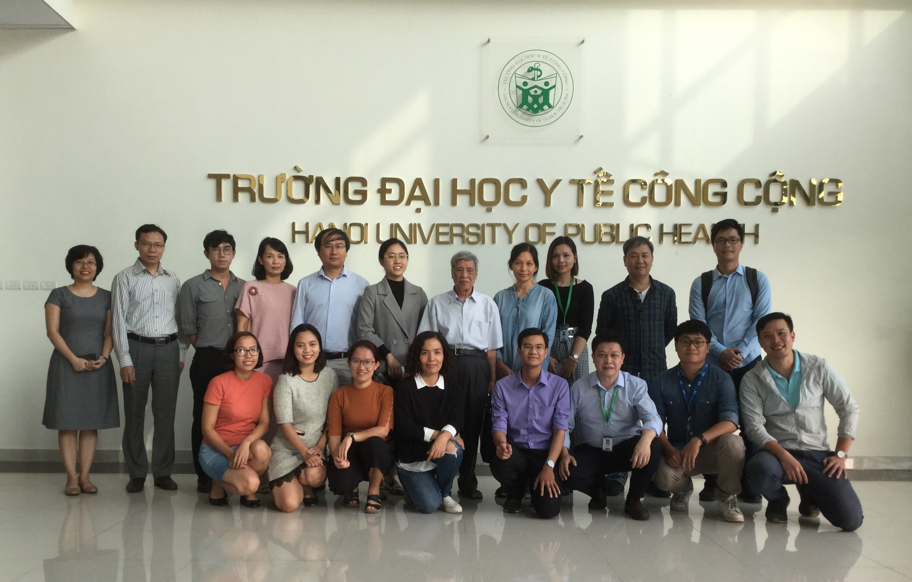





## Course overview

In this course, I briefly introduced about applied Bayesian statistics in health science research. I focused more on comparing the differences between Frequentist and Bayesian approaches. The course is appropriate for both people who have experience and those who are new in data analysis. 
This course included 9 lectures and 4 assignments, and was taught in 3 days. All materials were in Vietnamese. 

Participants were public health students, clinical doctors, public health researchers, and lecturers

The materials of this seminar is available below

## Course materials

### Slides

*  Kiểm định giả thuyết thống kê (Hypothesis testing)  

*  Các khái niệm cơ bản về thống kê Bayesian (Basic concepts of Bayesian statistics)  

*  Ứng dụng Bayesian trong phân tích test chẩn đoán (Applying Bayes rule in diagnostic tests)  

*  So sánh tỷ lệ (Frequentist vs. Bayesian) (Example of comparing two proportions) 

*  Mô hình hồi quy theo Bayesian - Khái niệm (Bayesian models - concepts)  

*  Hồi quy tuyến tính Bayesian (Bayesian linear model)  

*  MCMC và prior, ví dụ với mô hình log-binomial (MCMC and prior, example with log-binomial regression)  

*  Checklist thông tin cần trình bày trong phân tích Bayesian (Reporting in Bayesian - checklist) 

*  Trình bày phương pháp và kết quả của phân tích Bayesian (Reporting in Bayesian - presentation)  

### Data

* Here you can download data used in this course [](https://github.com/khuongquynhlong/online_cv/tree/master/Courses/5.%20Bayesian%20statistics/Data)

### Assignments

* Assignments [](https://github.com/khuongquynhlong/online_cv/tree/master/Courses/5.%20Bayesian%20statistics/Assignments)

## Some moments

Course in 2019

 

Course in 2018

 